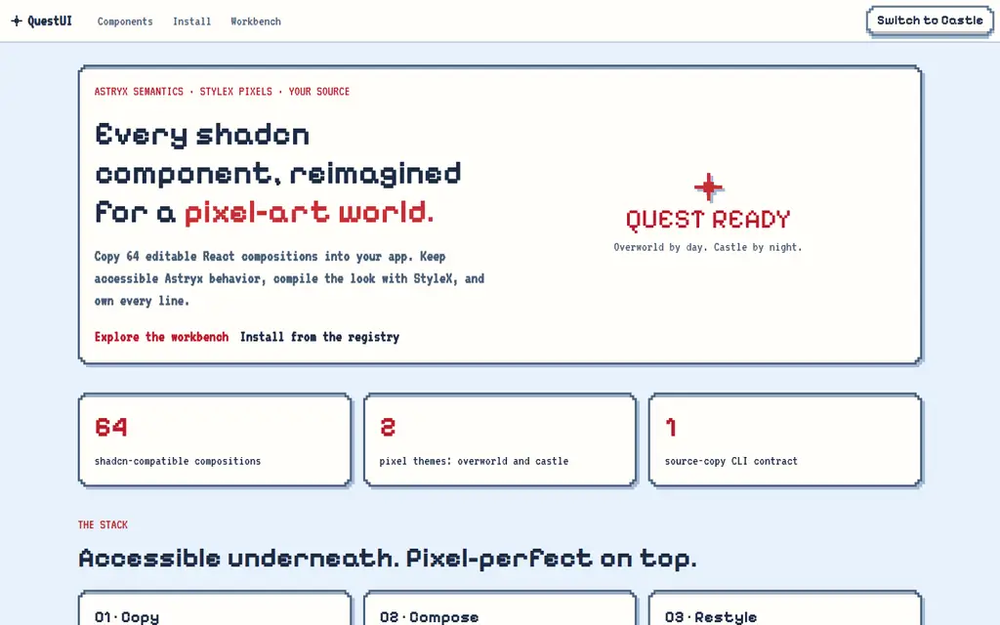

<div align="center">

# QuestUI

**Every shadcn component, reimagined for a pixel-art world.**

Editable React source · Astryx semantics · StyleX styling · 64 components · 2 themes

[Live homepage](https://questui.yougotserved.dev) · [Component workbench](https://questui.yougotserved.dev/demo) · [Component catalog](docs/components.md) · [AI guide](docs/ai.md)

</div>



QuestUI is a source-copy component library for React 19. It covers the complete current shadcn catalog with original pixel-art presentation while keeping interaction semantics, focus management, keyboard behavior, and announcements in [Astryx](https://www.npmjs.com/package/@astryxdesign/core). StyleX compiles the theme and component styles.

The registry copies editable TypeScript into your application. You own the composition source; Astryx and StyleX stay as dependencies.

## What ships

| Surface | Contract |
|---|---|
| Components | 64 shadcn-compatible compositions |
| Delivery | shadcn registry items generated at `/r/quest-<name>.json` |
| CLI | `quest-ui init`, `list`, `add`, and `swizzle` |
| Styling | StyleX with `overworld` and `castle` Quest themes |
| Semantics | Astryx primitives or the correct native platform element |
| Source | Editable TypeScript copied into the consumer app |
| AI context | `llms.txt`, exact file map, component catalog, and change workflow |

The catalog includes foundations, forms, navigation, overlays, data display, charts, resizable panels, conversation surfaces, attachments, message scrolling, and questionnaire flows. See [the complete table](docs/components.md) for every CLI slug, export, and Astryx foundation.

## Quick start

### 1. Install the CLI from GitHub

```sh
npm install --save-dev github:Kadajett/QuestUI
```

QuestUI currently publishes its installable package through the repository rather than npm.

### 2. Initialize an existing Vite React TypeScript app

```sh
npx quest-ui init \
  --framework vite \
  --registry https://questui.yougotserved.dev/r \
  --cwd ./my-app \
  --yes
```

The guarded initializer:

- adds the StyleX Vite plugin before React;
- configures the `@/*` alias and source-copy `components.json`;
- installs pinned Astryx and StyleX dependencies;
- copies the Quest theme, fonts, and license notices;
- imports Astryx reset/theme CSS once; and
- wraps the existing React root in `Theme`.

It preserves existing plugins and application code. Unsupported project shapes fail before local files are written.

### 3. Copy components

```sh
npx quest-ui add button card dialog data-table \
  --registry https://questui.yougotserved.dev/r \
  --cwd ./my-app \
  --yes
```

Then import the copied source directly:

```tsx
import {Button} from '@/components/quest/button'
import {Card, CardContent} from '@/components/quest/card'
```

List valid names offline:

```sh
npx quest-ui list
```

Use `QUEST_UI_REGISTRY=https://questui.yougotserved.dev/r` to omit `--registry`. Standard `shadcn add` options including `--overwrite`, `--diff`, `--view`, `--path`, and `--dry-run` pass through.

Read the [complete installation guide](docs/getting-started.md) for local registries, tarball installation, other bundlers, and swizzling.

## Why this architecture

```text
quest-ui CLI
  └─ shadcn-compatible registry item
      └─ editable Quest TypeScript composition
          ├─ Astryx interaction and accessibility semantics
          ├─ StyleX-compiled pixel presentation
          └─ Quest theme tokens and bundled fonts
```

- **Source-copy over wrappers.** Consumers can adapt composition code without forking a package abstraction.
- **Astryx over rebuilt primitives.** Dialogs, menus, selectors, calendars, and other stateful controls retain established interaction behavior.
- **StyleX over global component CSS.** Styles remain colocated, statically compiled, and theme-aware.
- **Theme tokens over one-off values.** The same stepped corners, hard shadows, typography, and state colors hold across the catalog.
- **Generated registry over hand-maintained JSON.** `cli/catalog.ts` is the catalog source of truth; `npm run registry` calculates each component's transitive source/style closure.

## Themes

`questTheme` extends Astryx's neutral theme with two modes:

- **Overworld:** clear sky, parchment surfaces, cobalt controls, and quest red.
- **Castle:** moonlit iron surfaces, crimson accents, and high-contrast text.

Both modes include forced-colors and reduced-motion behavior where the underlying interaction needs it. Fonts are bundled in `public/fonts` with their OFL notices.

```tsx
import '@astryxdesign/core/reset.css'
import '@astryxdesign/core/astryx.css'
import './components/quest/fonts.css'
import {Theme} from '@astryxdesign/core/theme'
import {questTheme} from './components/quest/theme'

<Theme theme={questTheme} mode="light">
  <App />
</Theme>
```

## CLI reference

```text
quest-ui list
quest-ui init --framework vite --registry <base-url> [--cwd APP] [--dry-run]
quest-ui add <component...> --registry <base-url> [shadcn add options]
quest-ui swizzle <component> [--output DIR] [--cwd APP] [--overwrite]
```

- `list` and `--help` stay offline.
- `init` and `add` delegate source delivery to pinned `shadcn@4.21.0`.
- `swizzle` ejects the corresponding Astryx implementation and preserves its license.
- Registry URLs must be absolute HTTP(S) base URLs without credentials, query strings, or fragments.

## Pixel avatar companion

`packages/pixel-avatars` is an independent source package, not a registry component. It provides deterministic 48×48 SVG avatars with selectable hair, eyes, face, skin, clothing, and background catalogs.

```tsx
import {PixelAvatar, createAvatar} from '@quest-ui/pixel-avatars'

<PixelAvatar selection={createAvatar('mira')} size={96} label="Mira" />
```

The render-only entry has no React or StyleX dependency. The workbench includes six selectors and a 48-avatar gallery.

## AI-friendly repository map

Start with [`llms.txt`](llms.txt) or the [AI integration guide](docs/ai.md).

| Task | Read first |
|---|---|
| Choose or install a component | `docs/components.md`, `docs/getting-started.md` |
| Change component behavior | `components/quest/<name>.tsx` and its focused tests |
| Change visual language | `components/quest/theme.ts` and shared StyleX modules |
| Add a catalog entry | `docs/ai.md` completion checklist |
| Change CLI delivery | `cli/quest.ts`, `cli/init.ts`, `scripts/build-registry.ts` |
| Verify the packaged consumer | `scripts/verify-consumer.ts` |

Before inventing an Astryx interface, discover it:

```sh
npx astryx build "<screen or interaction>"
npx astryx component <Name>
npx astryx search "<capability>"
npx astryx docs layout
npx astryx docs tokens
```

## Development

```sh
npm install
npm run dev                 # homepage + workbench on http://localhost:5173
npm test                    # Vitest behavior suite
npm run test:e2e            # Playwright interaction and screenshot suite
npm run build               # typecheck, CLI, registry, and Vite production build
npm run engineering:check   # project quality gates
node scripts/verify-consumer.ts
```

The packaged-consumer verifier packs the real CLI, initializes a fresh Vite app, installs every component separately, and runs a production TypeScript/StyleX build. It expects the local registry server on port 5173.

## Current boundaries

- Automatic initialization supports npm + Vite + React + TypeScript + ESM.
- Other bundlers require manual StyleX compiler integration.
- Quest button link polymorphism is not implemented; use Astryx `Link` for navigation.
- Accessibility verification covers Chromium interaction, both themes, forced colors, reduced motion, and a narrow viewport. Screen-reader and physical-device testing remain separate release checks.

## Third-party notices

Generated registry items include the Astryx license notice. Bundled fonts retain their OFL licenses in `public/fonts`. No separate project license is declared by this repository.
